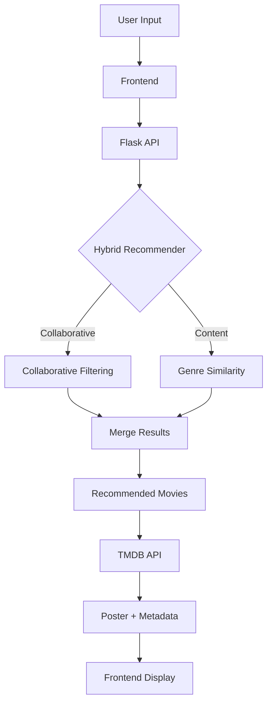

# Movie Recommendation System

A full-stack machine learning application that recommends movies based on user input.
The system combines collaborative filtering and content-based similarity using the MovieLens dataset, and displays recommendations through a web interface with movie posters and metadata.

The project demonstrates how machine learning models can be integrated with APIs and a frontend interface to build an end-to-end recommendation system.

---

## Overview

Recommendation systems are widely used by modern streaming platforms to help users discover relevant content. This project implements a simplified version of such a system using:

* Collaborative filtering based on user ratings
* Content-based similarity using movie genres
* A hybrid recommendation strategy combining both methods
* A Flask API backend
* A browser-based frontend interface
* Metadata and posters from the TMDB API

---

## System Architecture



---

## Dataset

This project uses the MovieLens 20M Dataset created by the GroupLens Research Lab at the University of Minnesota.

The dataset contains 20 million user ratings and tagging activities applied to 27,000 movies by 138,000 users. It is widely used in research on recommender systems and collaborative filtering algorithms.

Dataset sources:

GroupLens official site
https://grouplens.org/datasets/movielens/

Kaggle mirror (used in this project)
https://www.kaggle.com/datasets/grouplens/movielens-20m-dataset

### Important files

**movies.csv**

Contains movie metadata.

```
movieId,title,genres
1,Toy Story (1995),Adventure|Animation|Children|Comedy|Fantasy
```

**ratings.csv**

Contains user ratings.

```
userId,movieId,rating
1,1,4.0
```

Used for collaborative filtering.

**links.csv**

Maps MovieLens movies to external databases.

```
movieId,imdbId,tmdbId
```

Used to fetch movie posters and metadata from TMDB.

---

## Recommendation Algorithm

The system uses a **hybrid recommendation model** combining two approaches.

### Collaborative Filtering

Collaborative filtering recommends movies based on patterns in user ratings.

Example:

```
Users who liked Toy Story also liked:
- Monsters Inc
- Finding Nemo
- Shrek
```

Implementation uses a **K-Nearest Neighbors (KNN)** model trained on the user-movie ratings matrix.

Libraries used:

* scikit-learn
* numpy
* scipy
* pandas

---

### Content-Based Filtering

Content-based recommendations are generated using movie genres.

Example:

```
Toy Story
Adventure | Animation | Comedy

Similar movies:
- Shrek
- Despicable Me
- Tangled
```

Genres are converted into feature vectors and compared using cosine similarity.

---

### Hybrid Model

The final recommendation list merges results from both methods:

```
Collaborative Filtering
+
Genre Similarity
```

This improves recommendation diversity and accuracy.

---

## Backend

The backend is built using **Flask** and exposes a simple REST API.

### Recommendation endpoint

```
POST /recommend
```

Request:

```
{
  "movie": "Toy Story"
}
```

Response:

```
[
  { "title": "Toy Story 2 (1999)", "tmdbId": 863 },
  { "title": "Finding Nemo (2003)", "tmdbId": 12 }
]
```

---

### Search suggestions

```
GET /search?q=toy
```

Used by the frontend to implement autocomplete.

---

## Frontend

The frontend is a lightweight web interface built with:

* HTML
* CSS
* JavaScript

Features include:

* Movie search with autocomplete
* Keyboard navigation for suggestions
* Poster grid display
* Hover-based movie information
* Loading indicator while fetching recommendations

Movie posters and metadata are retrieved from the TMDB API.

---

## Project Structure

## Project Structure

## Project Structure

```
movie-recommendation
│
├── app
│   ├── app.py              # Early backend / experimentation entry point
│   ├── server.py           # Main Flask API server used by the frontend
│   └── streamlit_app.py    # Optional Streamlit interface for testing
│
├── data                    # MovieLens dataset files
│   ├── movies.csv          # Movie metadata (title, genres)
│   ├── ratings.csv         # User ratings used for collaborative filtering
│   ├── links.csv           # Mapping from MovieLens IDs → TMDB / IMDB IDs
│   ├── genome_scores.csv   # Tag relevance scores for advanced features
│   ├── genome_tags.csv     # Tag descriptions used with genome scores
│   └── tags.csv            # User-generated tags for movies
│
├── frontend
│   └── index.html          # Web interface (HTML, CSS, JavaScript)
│
├── models                  # Saved machine learning models
│   ├── knn_model.pkl       # Trained KNN collaborative filtering model
│   ├── matrix.pkl          # User–movie sparse rating matrix
│   ├── movie_index.pkl     # Mapping from movieId → matrix index
│   └── genre_sim.pkl       # Genre similarity matrix for content-based filtering
│
├── notebook
│   └── movie_recommender.ipynb   # Development notebook for experimentation
│
├── src                     # Core machine learning code
│   ├── content_model.py    # Builds genre similarity model
│   ├── data_loader.py      # Loads and prepares dataset
│   ├── model.py            # Collaborative filtering model logic
│   ├── recommender.py      # Hybrid recommendation algorithm
│   └── train.py            # Training script to generate model files
│
├── env                     # Local Python virtual environment (not committed)
├── .gitignore              # Files ignored by Git
├── requirements.txt        # Python dependencies
└── README.md               # Project documentation
```

---

## Running the Project

### Install dependencies

```
pip install -r requirements.txt
```

### Train the model

```
python src/train.py
```

This generates the trained model files in the `models` directory.

### Start the backend

```
python app/server.py
```

Server runs at:

```
http://127.0.0.1:5000
```

### Start the frontend

Open:

```
frontend/index.html
```

or run a simple server:

```
cd frontend
python -m http.server 8000
```

Then open:

```
http://localhost:8000
```

---

## Technologies Used

* Python
* Flask
* scikit-learn
* NumPy
* Pandas
* SciPy
* HTML
* CSS
* JavaScript
* TMDB API
* MovieLens Dataset

---

## Future Improvements

Possible extensions include:

* Deep learning recommendation models
* Personalized recommendations using user history
* Visualization of movie similarity clusters
* Deployment using Docker or cloud platforms
* Enhanced metadata features using genome tags

---

## License

This project is intended for educational and research purposes.

Dataset: MovieLens
Metadata API: TMDB
